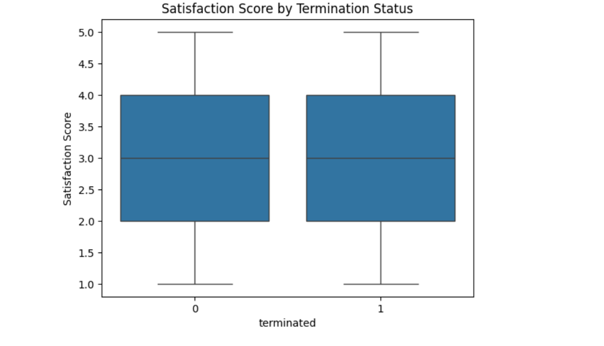

# HR Analytics Dashboard 📊  

## Overview  
This project explores HR analytics data to uncover trends in employee engagement, satisfaction, and termination patterns using Python.  

## Features  
✅ Data cleaning and preprocessing  
✅ Exploratory Data Analysis (EDA)  
✅ Visualizations using Seaborn & Matplotlib  
✅ Insights into employee satisfaction and termination rates  

## Technologies Used  
- Python (Pandas, NumPy, Matplotlib, Seaborn)  
- Jupyter Notebook  

## Key Findings  
📌 Employees with lower satisfaction scores are more likely to be terminated.  
📌 Work-life balance significantly impacts retention.  
📌 Performance scores correlate with engagement levels.  

## Visuals  
### *Satisfaction Score by Termination Status*  
  

## How to Use  
1. Clone the repository:  
   ```bash
   git clone https://github.com/AnaMaria779/HR-Analytics-Dashboard.git
